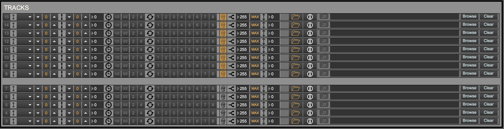

+++
title = "MIDI Tracks View"
weight = 40
+++

  

#### Track effects
  

See effects.

#### File/track info select

Selecting either the _folder_ button or the _information_ (i) button will open the view to either load a track, or see the current playback data of the track.

#### Load MIDI track
  
You can load a track that does not follow the chord progression in the song file. If the track contains chords that are used in the song file, though, the [improviser]() will use this chord information to create a harmonically correct solo!

#### Track info view
  
This displays the current beat, the current tempo, and the current transposition that the improviser has found, if this setting is on.

