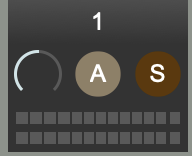

+++
title = "Audio Out Bank"
weight = 30
+++

  

The audio out bank contains three (3) audio output controls. These are similar to MIDI output controls.  
 
 

### Volume Dial

Changes the volume of the MIDI track. If you click just above the dial, the dial will reset to its default value of 80.

### Active Button

If not illuminated, the MIDI track will not be audible, and its volume in the volume meter will be gray. When illuminated, the MIDI track will be audible.

### Solo Button

When illuminated, this will "solo" the MIDI track. If a single track is soloed, it is the only track that you will hear. If several MIDI tracks are soloed, only these tracks will be audible. If no tracks are soloed, all the tracks will be audible.

### Volume Meter
Shows the level of the MIDI output. When a track is inactive, this will be grey. When active, the output will be green, orange, and red, depending on the volume level.