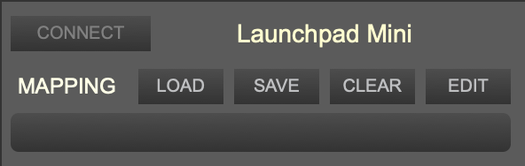

+++
title = "External Controllers"
weight = 50
+++

External controllers such as Launchpads or MIDI keyboards can be used to trigger controls in Djazz.  

Djazz has been tested with the [Novation Launchpad Mini](https://novationmusic.com/products/launchpad-mini-mk3?srsltid=AfmBOorZuro5Jhp9EVRYpPUCse3BTIyn-qjvLLBOxDN12salslF5fxE1) and the [Launchpad Pro MK3](https://novationmusic.com/products/launchpad-pro-mk3?srsltid=AfmBOopLs9R1iUVXI_b4RXoBS45-QtDn7rCuFcB5o6HAp6749z2mEWDi).

To use a new kind of Launchpad, an interface must be added to the Djazz patch

## Connect/disconnect a device
  
When a device is connected to the computer, Djazz will automatically recognize it and its name will be added to the _external controllers_ menu, and a popup window will also open.
This popup window can be reopened at any time by selecting the interface name from the menu.  
To disconnect all devices, click the "X" button above and to the left of the menu.  

## Device interface window
  
#### Connect/Disconnect button
Click to connect or disconnect a device. By default, devices are disconnected.
#### Mapping Buttons
Load a saved mapping, save the current mapping, clear the current mapping, or open the editor widow to edit the current mapping.  
#### Mapping file name window
Displays the current loaded mapping, if any.  
#### Remember most recent mapping
If you want Djazz to remember the mapping it was using the last time the program was closed, do the following:
1. With the device interface window in focus, select **Modify Read-Only** from the Max **File** Menu, or press ⌥⌘M.
2. From the Max **File** menu, select **Save**, or press ⌘S.

#### Grid View
The top four rows of each launchpad are reserved for the bars of the song grid. The CC controls along the right side of a Launchpad change the chapters.

#### Parameter controls
The bottom four rows are available as parameter controls, which can be set by the user using the preset editor window.

## The mapping editor window
  

#### Create/edit a mapping
To create a new mapping from a launchpad cell to a Djazz control, click the _Edit_ button in the device interface window to open the mapping editor window. Follow the instructions to set the mapping. To save the mapping, click "Save" in the interface device window.  

## Example mappings included with Djazz

There are three (3) Launchpad mappings included with Djazz, for the [Novation Launchpad Mini](https://novationmusic.com/products/launchpad-mini-mk3?srsltid=AfmBOorZuro5Jhp9EVRYpPUCse3BTIyn-qjvLLBOxDN12salslF5fxE1) and the [Launchpad Pro MK3](https://novationmusic.com/products/launchpad-pro-mk3?srsltid=AfmBOopLs9R1iUVXI_b4RXoBS45-QtDn7rCuFcB5o6HAp6749z2mEWDi).  They can be found in the _djazz_user/mappings_ folder.  The mappings are as follows:

### MAPPING EXAMPLE 1
###### LAUNCHPAD PRO MK3

<table class="lp_mapping">
<tdead>
</tdead>
<tbody>
<tr>
    <td class="blue" >AUDIO 1 LOOP 1</td>
    <td class="blue" >AUDIO 1 LOOP 2</td>
    <td class="blue" >AUDIO 1 LOOP 3</td>
    <td class="blue" >AUDIO 1 LOOP 4</td>
    <td class="purple">AUDIO 2 LOOP 1</td>
    <td class="purple">AUDIO 2 LOOP 2</td>
    <td class="purple">AUDIO 2 LOOP 3</td>
    <td class="purple">AUDIO 2 LOOP 4</td>
</tr>
<tr>
    <td class="yellow">AUDIO 1 SPEED 2</td>
    <td class="brown">AUDIO 1 PITCH UP</td>
    <td class="green" >AUDIO 1 OCTAVE UP</td>
    <td class="orange">AUDIO 1 UNMUTE</td>
    <td class="yellow">AUDIO 2 SPEED 2</td>
    <td class="brown">AUDIO 2 PITCH UP</td>
    <td class="blue" >AUDIO 2 OCTAVE UP</td>
    <td class="orange">AUDIO 2 UNMUTE</td>
</tr>
<tr>
    <td class="yellow">AUDIO 1 SPEED 3/2</td>
    <td class="brown">AUDIO 1 RESET PITCH</td>
    <td class="green" >AUDIO 1 RESET OCTAVE</td>
    <td class="brown">AUDIO 1 TRACK ON</td>
    <td class="yellow">AUDIO 2 SPEED 3/2</td>
    <td class="brown">AUDIO 2 RESET PITCH</td>
    <td class="blue" >AUDIO 2 RESET OCTAVE</td>
    <td class="brown">AUDIO 2 TRACK ON</td>
</tr>
<tr>
    <td class="yellow">AUDIO 1 SPEED 1/2</td>
    <td class="brown">AUDIO 1 PITCH DOWN</td>
    <td class="green">AUDIO 1 OCTAVE DOWN</td>
    <td class="red"   >AUDIO 1 IMPROVISE</td>
    <td class="yellow">AUDIO 1 SPEED 1/2</td>
    <td class="brown">AUDIO 1 PITCH DOWN</td>
    <td class="blue">AUDIO 1 OCTAVE DOWN</td>
    <td class="red"   >AUDIO 2 IMPROVISE</td>

</tr>
</tbody>
</table>

###### LAUNCHPAD MINI
<table class="lp_mapping">
<tdead>
</tdead>
<tbody>
<tr>
    <td class="green" >AUDIO 1 LOOP 1</td>
    <td class="green" >AUDIO 1 LOOP 2</td>
    <td class="green" >AUDIO 1 LOOP 3</td>
    <td class="green" >AUDIO 1 LOOP 4</td>
    <td class="red">AUDIO 2 LOOP 1</td>
    <td class="red">AUDIO 2 LOOP 2</td>
    <td class="red">AUDIO 2 LOOP 3</td>
    <td class="red">AUDIO 2 LOOP 4</td>
</tr>
<tr>
    <td class="yellow">AUDIO 1 SPEED 2</td>
    <td class="orange">AUDIO 1 PITCH UP</td>
    <td class="green" >AUDIO 1 OCTAVE UP</td>
    <td class="yellow">AUDIO 1 UNMUTE</td>
    <td class="yellow">AUDIO 2 SPEED 2</td>
    <td class="orange">AUDIO 2 PITCH UP</td>
    <td class="green" >AUDIO 2 OCTAVE UP</td>
    <td class="yellow">AUDIO 2 UNMUTE</td>
</tr>
<tr>
    <td class="yellow">AUDIO 1 SPEED 3/2</td>
    <td class="orange">AUDIO 1 RESET PITCH</td>
    <td class="green" >AUDIO 1 RESET OCTAVE</td>
    <td class="orange">AUDIO 1 TRACK ON</td>
    <td class="yellow">AUDIO 2 SPEED 3/2</td>
    <td class="orange">AUDIO 2 RESET PITCH</td>
    <td class="green" >AUDIO 2 RESET OCTAVE</td>
    <td class="orange">AUDIO 2 TRACK ON</td>
</tr>
<tr>
    <td class="yellow">AUDIO 1 SPEED 1/2</td>
    <td class="orange">AUDIO 1 PITCH DOWN</td>
    <td class="green">AUDIO 1 OCTAVE DOWN</td>
    <td class="red"   >AUDIO 1 IMPROVISE</td>
    <td class="yellow">AUDIO 1 SPEED 1/2</td>
    <td class="orange">AUDIO 1 PITCH DOWN</td>
    <td class="green">AUDIO 1 OCTAVE DOWN</td>
    <td class="red"   >AUDIO 2 IMPROVISE</td>

</tr>
</tbody>
</table>

### MAPPING EXAMPLE 2
###### LAUNCHPAD PRO MK3 & LAUNCHPAD PRO MK3

<table class="lp_mapping">
<tdead>
</tdead>
<tbody>
<tr>
    <td class="orange">MIDI OUT 1 UNMUTE</td>
    <td class="orange">MIDI OUT 2 UNMUTE</td>
    <td class="orange">MIDI OUT 3 UNMUTE</td>
    <td class="orange">MIDI OUT 4 UNMUTE</td>
    <td class="orange">MIDI OUT 5 UNMUTE</td>
    <td class="orange">MIDI OUT 6 UNMUTE</td>
    <td class="orange">MIDI OUT 7 UNMUTE</td>
    <td class="orange">MIDI OUT 8 UNMUTE</td>
</tr>
<tr>
    <td class="red"   >MIDI TRACK 1 IMPROVISE</td>
    <td class="red"   >MIDI TRACK 2 IMPROVISE</td>
    <td class="red"   >MIDI TRACK 3 IMPROVISE</td>
    <td class="red"   >MIDI TRACK 4 IMPROVISE</td>
    <td class="red"   >MIDI TRACK 5 IMPROVISE</td>
    <td class="red"   >MIDI TRACK 6 IMPROVISE</td>
    <td class="red"   >MIDI TRACK 7 IMPROVISE</td>
    <td class="red"   >MIDI TRACK 8 IMPROVISE</td>
</tr>
<tr>
    <td class="orange">MIDI OUT 9 UNMUTE</td>
    <td class="orange">MIDI OUT 10 UNMUTE</td>
    <td class="orange">MIDI OUT 11 UNMUTE</td>
    <td class="orange">MIDI OUT 12 UNMUTE</td>
    <td class="orange">MIDI OUT 13 UNMUTE</td>
    <td class="orange">MIDI OUT 14 UNMUTE</td>
    <td class="orange">MIDI OUT 15 UNMUTE</td>
    <td></td>
</tr>

<tr>
    <td class="red"   >MIDI TRACK 9 IMPROVISE</td>
    <td class="red"   >MIDI TRACK 10 IMPROVISE</td>
    <td class="red"   >MIDI TRACK 11 IMPROVISE</td>
    <td class="red"   >MIDI TRACK 12 IMPROVISE</td>
    <td class="red"   >MIDI TRACK 13 IMPROVISE</td>
    <td class="red"   >MIDI TRACK 14 IMPROVISE</td>
    <td class="red"   >MIDI TRACK 15 IMPROVISE</td>
    <td></td>

</tr>
</tbody>
</table>

### MAPPING EXAMPLE 3 (Marc Chemillier's original)
###### LAUNCHPAD MINI & PRO MK3
<table class="lp_mapping">
<tdead>
</tdead>
<tbody>
<tr>
    <td class="yellow" >GLOBAL SPEED 1/2</td>
    <td class="green" >MIDI OUT 8 UNMUTE</td>
    <td class="green" >MIDI OUT 9 UNMUTE</td>
    <td class="green" >MIDI OUT 10 UNMUTE</td>
    <td class="green">MIDI OUT 11 UNMUTE</td>
    <td class="green">MIDI OUT 12 UNMUTE</td>
    <td class="yellow">GLOBAL LOOP 5</td>
    <td class="yellow">GLOBAL LOOP 1</td>
</tr>
<tr>
    <td class="yellow" >GLOBAL SPEED 3/2</td>
    <td class="green" >MIDI OUT 13 UNMUTE</td>
    <td class="green" >MIDI OUT 14 UNMUTE</td>
    <td class="orange" >GLOBAL RESET OCTAVE</td>
    <td class="orange">GLOBAL OCTAVE DOWN</td>
    <td class="orange">GLOBAL OCTAVE UP</td>
    <td class="yellow">GLOBAL LOOP 6</td>
    <td class="yellow">GLOBAL LOOP 2</td>
</tr>
<tr>
    <td class="yellow" >GLOBAL SPEED 2</td>
    <td class="green" >MIDI OUT 3 UNMUTE</td>
    <td class="green" >MIDI OUT 4 UNMUTE</td>
    <td class="green" >MIDI OUT 5 UNMUTE</td>
    <td class="green">MIDI OUT 6 UNMUTE</td>
    <td class="green">MIDI OUT 7 UNMUTE</td>
    <td class="yellow">GLOBAL LOOP 7</td>
    <td class="yellow">GLOBAL LOOP 3</td>
</tr>
<tr>
    <td class="yellow">GLOBAL SPEED 4</td>
    <td class="green">AUDIO OUT 1 UNMUTE</td>
    <td class="green">AUDIO OUT 2 UNMUTE</td>
    <td class="green">AUDIO OUT 3 UNMUTE</td>
    <td></td>
    <td></td>
    <td class="yellow">GLOBAL LOOP 8</td>
    <td class="yellow">GLOBAL LOOP 4</td>

</tr>
</tbody>
</table>

