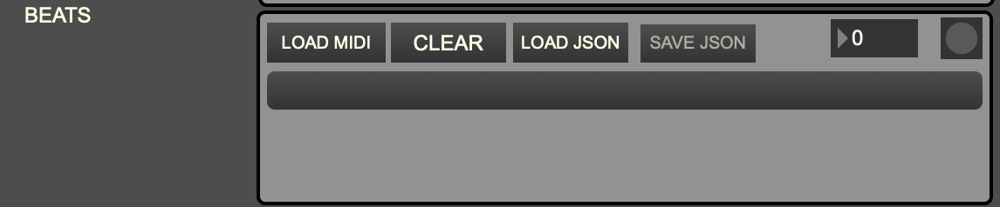
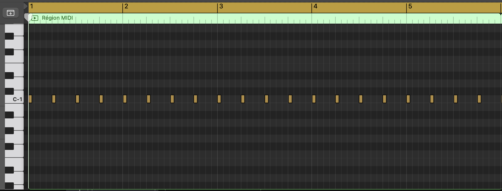
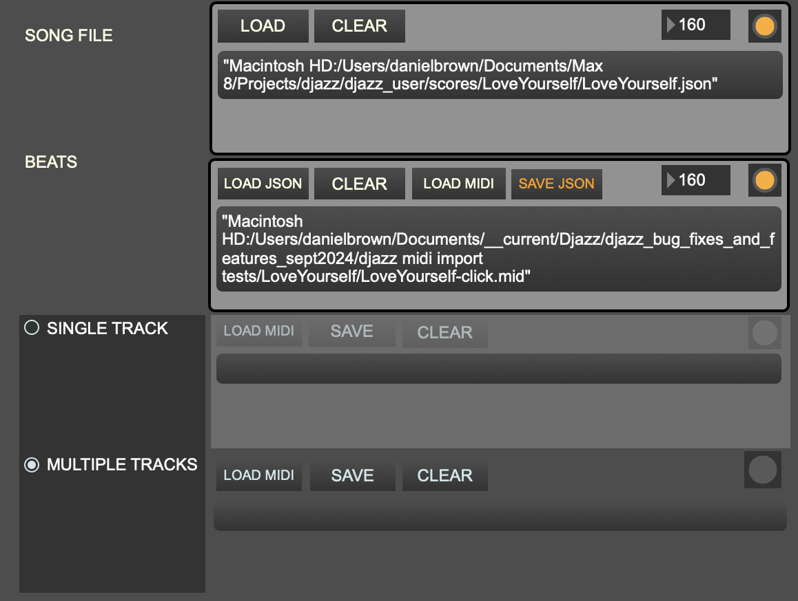

+++
title = "Making a Score File"
weight = 20
+++


Score files contain preloaded notes, formatted so that Djazz can play them and use them to improvise.
Djazz comes preloaded with many score files of jazz standards and songs from Madagascar. You can also 
convert your own MIDI files into Djazz scores with the _make_score_file_ Max patcher, located in the _tools_ folder.

###### 1. Load a song file  

  
If you haven't yet made a song file for this song, make one using the [make_song_file]() tool.
 Import the song file by pressing the LOAD button. If the file is loaded properly, the light on the left side will illuminate.

###### 2. Load a click track  
    

    
A click track is needed to divide the notes in the MIDI tracks into the proper beats.
A click track must be imported from a MIDI file in which eat beat is designated by a single MIDI event at pitch C1 and non-zero velocity
The click track be exported at the same tempo as the notes.  

  
    
Import the MIDI file by pressing the "IMPORT MIDI" button and selecting the file from the dialog that opens.
Once imported, you can save this file to a JSON format using the "SAVE JSON" button.
If the click track file is loaded properly, the light on the left side will illuminate.
    
###### 3. Load a single or multiple tracks
If both the song file and click track have loaded successfully, the regions for loading MIDI tracks will be activated.
You can load either a single MIDI track, or multiple tracks at once. If you import multiple tracks, the resulting JSON file will represent a Djazz _score_, which you will need to put into a folder in order to play it in Djazz (see below).  
  

**NOTE: Tracks available for Djazz are 3 through 15, because tracks 1 and 2 are used for Live MIDI. Make sure the MIDI tracks are exported from your DAW with appropriate track numbers.**

Once you have imported, either in the single or multiple MIDI track format, save your import by pressing the "Save" button. The resulting file will be a JSON file.

To play a _single_ MIDI track, see these instructions.

To play _multiple_ MIDI tracks, you need to put your saved file in an appropriately named folder.

### MAKING A SCORE FOLDER

Multiple MIDI tracks saved together are called a _score_ in Djazz. Score files and their corresponding song files need to be organized into a certain folder structure--a **song folder**--for Djazz to read them.

The format for a **song folder** is this:

```
MySongFolder
├── MySongFolder.json
├── new
│   ├── score_1.json
│   ├── another_score.json
│   ├── another-score_1.json
│   └── ... 
├── new2
│   ├── some_score.json
│   └── may_song_score.json
│   └── ...
```

The song folder must have the same name as the JSON song file.
The top level of the song folder contains three things: 
    - the JSON song file
    - two directories for score files. These directories must be labeled "new" and "new2."

A song folder placed into the _djazz_user/scores_ folder inside the Djazz directory will appear in the song dropdown menu.  

The contents of the two score directories will be loaded when a song folder is loaded and their contents displayed in the respective dropdown menus.

