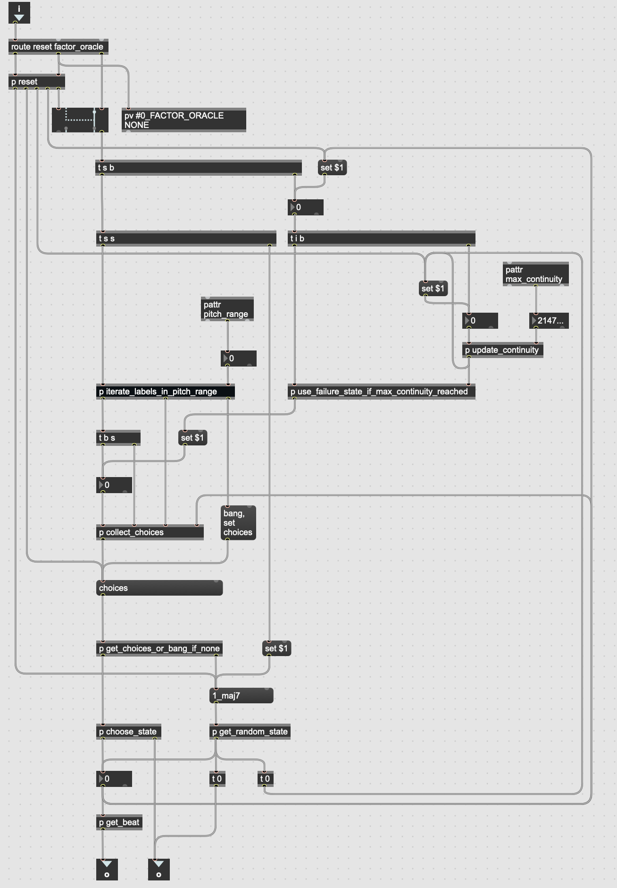

+++
title = "Factor Oracle and Player"
weight = 20
+++

### The factor oracle

The factor oracle data structure is described in detail in the following references:

[Allauzen, Crochemore, Raffinot. 1999. Factor Oracle: A New Structure for Pattern Matching. SOFSEM '99: Proceedings of the 26th Conference on Current Trends in Theory and Practice of Informatics on Theory and Practice of Informatics. pp. 295 - 310](https://hal.science/hal-00619846v1/document)

[Gérard Assayag, Shlomo Dubnov. Using Factor Oracles for machine Improvisation. Soft Computing, 2004, 8 (9), pp.604-610.](https://hal.science/hal-01161221v1/document)

[Maxime Crochemore, Lucian Ilie, Emine Seid-Hilmi. The structure of Factor Oracles. International Journal of Foundations of Computer Science, 2007, 18 (4), pp.781-797](https://hal.science/hal-00619689/)

[Gérard Assayag, Georges Bloch. NAVIGATING THE ORACLE: A HEURISTIC APPROACH. International Computer Music Conference '07, Aug 2007, Copenhagen, Denmark. pp.405-412.](https://hal.science/hal-01161388/document)

Djazz 2.0 uses a pure Max version of the factor oracle, factor_oracle.maxpat. 

### The factor oracle player

The factor oracle player creates the improvisation. As its name suggests, it contains and makes use of the "factor_oracle" Max abstraction. 

The available messages to the abstraction can be seen from looking into the patch:

The data structure itself is saved as a Max dict, where each key is an integer representing the beat number. The value associated with a key is the label of the beat. 

The Max dict containing the factor oracle data can be accessed by sending the message "dump," which sends the name of the Max dict out the rightmost outlet.

As with all the data-related patches in Djazz 2.0, no dict name is specific to this patch, and no dict is created or maintained inside this patch (see Handling Data"{{ < /apipage >}}).

The method for choosing beats from the factor oracle in a real-time improvisation setting is described in [Jérôme Nika, Marc Chemillier. Improtek: integrating harmonic controls into improvisation in the filiation of OMax. International Computer Music Conference (ICMC), Sep 2012, Ljubljana, Slovenia. pp.180-187.](https://hal.sorbonne-universite.fr/hal-01059330v1)

The factor_oracle_player.maxpat{{ </abstref >}} abstraction follows the algorithm described in section 3.4, "Constrained Navigation and Continuity," of the above paper. Its design is as follows:

When the maximum continuity is reached, it takes a suffix link and searches for a matching label. If no matching label is found, it chooses a random state.

The analyzer uses the same set of symbols as the factor oracle. It is used both offline, to create a file of labeled beats for a song, and online, to convert the data at the beginning of each beat into a symbol to be passed to the factor oracle player. 
This symbol is then used as the query to the factor oracle to produce the next beat.
