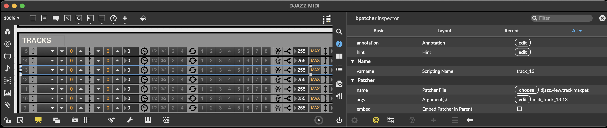
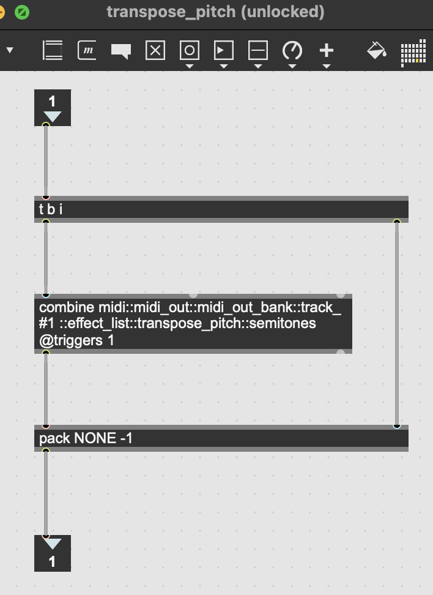

+++
title = "Asynchronous Data and the MVCVC Design"
weight = 20
+++

##### ARCHITECTURE

Djazz uses the familiar Model-View-Control-View Control (MVCVC) design pattern.  Each of these components will be discussed below.  This particular interpretation of MVCVC was influenced by the design specifications for audio plugin development for the [WWISE audio engine]() distributed by [Audiokinetic]().


flowchart TB;

V[View];
C[Control];
M[Model];
VC[View Control];

V --> C
C --> M
M --> VC
VC --> V


This design is primarily to maintain an organised control flow of asynchronous data--data that is input by the user.  This is done using Max's pattr system; any user-controlled variable is stored as a separate pattr in the view, control, the model, and possibly the view control.  Their values are passed through each of these components in a directed path, possibly undergoing name translation or value conversion along the way:


flowchart TB;

subgraph V[View];
end

subgraph C[Control];
direction TB
    tvc[translate view to control]
    ctrlpattrs[control pattrs]
    tcm[translate control to model]
    tvc --> ctrlpattrs--> tcm
end

subgraph M[Model];
end

subgraph VC[View Control];
direction TB
    tmv[translate model to view]
end

V --> tvc
tcm --> M
tmv --> V
M --> tmv



While the path resembles a loop, [output restriction]() in the view in fact keep messages from being passed on, thus avoiding circularity.  

#### MODEL
The model (djazz.maxpat) is the actual Djazz patcher, in the sense that all the functionality occurs in this patcher: MIDI and audio input and output processing, timing synchronization, improvisation calculation, etc.  

Abstractions in the model contain pattrs which are set by sending messages in the form <_pattr name_> <_pattr value_>.
The _pattrhub_ Max object distributes these messages to the appropriate pattr objects.

#### CONTR0L
The control acts as the interface to pass messages to the model.  It is similar to a shell in an operating system, or a parameter bank in an audio plugin.  Its input represents the set of all possible asynchronous messages that can be sent to Djazz.  Its job is to translate these messages to their appropriate messages that the model understands, and to handle any value initialization and message dependencies.  

There are many pattrs in the model.
- Not all pattrs may be desired to be used, or exposed to the user.
- The organization of the pattr hierarchy in the model may not reflect the user's conception
- it may be wished to call pattrs in the model via other variables that need some processing to determine their value.

The control, then, acts a shell which exposes the messages that can be sent to Djazz. By replacing the control, you can change the commands it responds to without changing the model itself.

To make modularity easier, pattrs in the control are grouped in encapsulations.  This means that calling nested pattrs demands the "::" syntax (see example below).


flowchart TB;

subgraph storage[storage];
    p1["user input pattr 1"];
    p2["user input pattr 2"];
    p3["user input pattr 3"];
end

T1["translator"]
T2["translator"]

q1["model pattr 1"]
q2["model pattr 2"]

p1 --> T1
p2 --> T1
p3 --> T2
T1 --> q1
T2 --> q2



#### VIEW CONTROL

The model outputs pattrs to any view that wants to receive them. It does this the same way as the control: a pattrstorage object is at the top level of the model patcher, and when a pattr value is updated, it outputs the pattr name and value.

There are two types of pattrs that the model outputs: those that are specifically for a view, and the parameters that were sent from the control.
Values in abstractions in the model that are to be sent to the view control are stored as pattrs inside subpatchers named "view," so that they can be extracted from the other pattrs passed out of hte model.

#### VIEW

The view is a collection of bpatchers containing graphical controls and data fields.  It triggers messages to be sent to the control.  Different views could be used, and even several views at the same time.  The Launchpad interfaces are also views.  

**Note:** with this method, the interior pattrhub objects end up not being used at all, but it’s still good to leave them in so that these objects can be reused and are not dependent on being called this way.

Finally, unused variables simply aren’t called. But to be absolutely sure that uncalled variables don’t give us trouble, by storing state that have forgotten about, or by accidentally being called, due to sharing names accidentally with a control variable, we can [turn off their visibility to the pattrstorage system](#pattr-visibility), which means they can never be called.

To avoid an infinite loop, we make use the pattrstorage object’s _outputmode_ attribute.
In the control and model, the pattrstorage _outputmode_ is set to 2: any changed values are sent out.
But in the view, the output mode is 6: values that are changed by objects in the pattr system are not sent out from the pattrstorage object. That is, only values that are changed by user interaction are sent out. Thus the values received by pattrhub are set, but not sent to the control.  This way, pattr values can be sent back from the model into the view (via the view control object which filters them and translates their names if necessary), without these pattr values being again passed out to the control (which would create an infinite loop).

##### EXAMPLE

As an example, we follow the message sent when the pitch on MIDI track 13 is changed, using either the up, down, or reset-pitch button:  
  

The corresponding pattr in the view is named _transpose_pitch_, and takes an integer value.  The up, down, and reset buttons are proper to the usage conceived for this particular graphical interface, so their logic is contained within the view; they modify the _transpose_pitch_ pattr and do not send any messages directly to the control.

In the view, the triggered pattr is located in the bpatcher named _track_13_, which itself is inside the bpatcher named _midi_.  When triggered, the pattrstorage object inside the view updates its value and sends out the message _midi::track_13::transpose_pitch 0_.  This message is sent out the second view outlet and into _djazz.control_.

In _djazz_control_, the pattrhub object distributes the message to the corresponding subpatcher named _midi_, which contains a _djazz.control.track_ abstraction named__track_13_, which contains a pattr object named _transpose_pitch_. 

This pattr now sends its updated value 0 directly (not via the pattrstorage object in djazz.control) through the _djazz.control.midi.translate_track_ abstraction in order to rename it for the correct pattr object in the model:  

The message sent to the model is _midi::midi_out::midi_out_bank::track_13::effect_list::transpose_pitch::semitones 0_. It is received by the pattrhub object in the model and sent to the corresponding patcher:  

When the pattr in the model is updated, the model's pattrstorage sends its name and value to the view control, which translates it and sends it back to the view.

The state of the variable can be seen in each of the four debug windows (view, control, model, and view control).

###### Pattr Visibility

For more complex abstractions that use several _pattrs_, as well as abstractions that lend themselves to reuse, such as the beat-generators which are nested in midi- and audio-beat-generators, Djazz uses the second method of pattr passing:  

flowchart LR;
in(( ))
subgraph A[A];
    subgraph B[B];
        subgraph C[C];
        direction TB
            p[pattr my_pattr]
        end
    end
end
in -->|A::B::C::my_pattr|p



flowchart LR;
in(( ))
subgraph A[A];
direction TB
    pA[pattr my_pattr_A]
subgraph B[B];
direction TB
    pB[pattr my_pattr_B]
subgraph C[C];
direction TB
    pC[pattr my_pattr_C]
end
end
end
in -->|my_pattr_A|pA
pA -->|my_pattr_B|pB
pB -->|my_pattr_C|pC



Pattrs within nested abstractions are "hidden" from calls to the exterior abstraction. They are updated by calling a pattr in the exterior abstraction, which translates them to the appropriate pattr call to the interior abstraction; sometimes this sequence of calls to nested pattrs has several levels.
In Max, a pattr is never actually hidden, as it can always be called using the double-colon syntax corresponding to the object in which it is located.  But a pattr can be hidden to the pattrstorage object that references it by setting the pattr's _visibility_ attribute to zero.  The small object pattrvis.js was written to turn on and off the visibility of all the pattrs in an abstraction; it can act hierarchically as well, turning on or off all the visibility of pattrs in subpatchers.  
The pattrvis.js object is used in the appropriate abstractions, and does not have an effect on the functionnality of the program.  It can be used to keep the debugging windows more readable, when nested pattrs have their visibility off. To inspect pattr messages passed to nested abstractions, turn their visibilities on by passing 1 to the pattrvis.js object in the corresponding abstraction.  