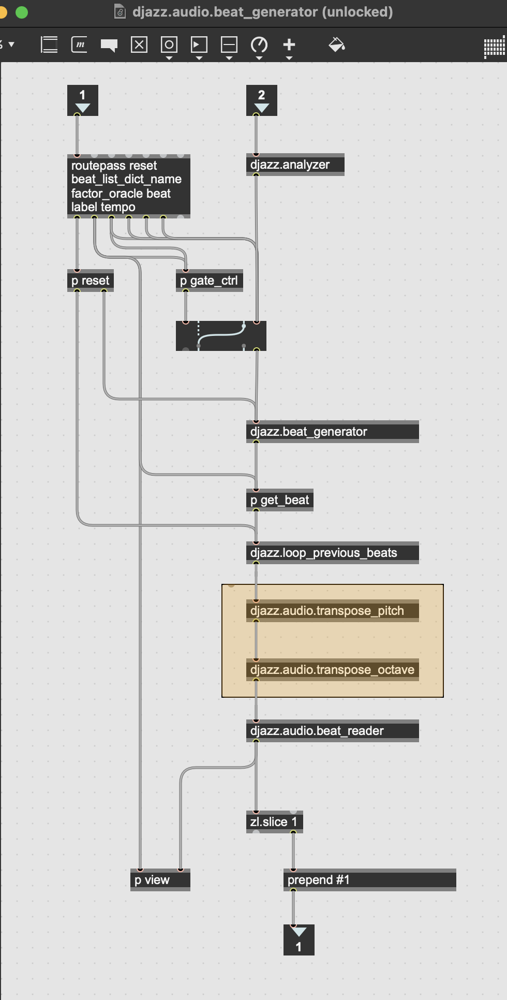
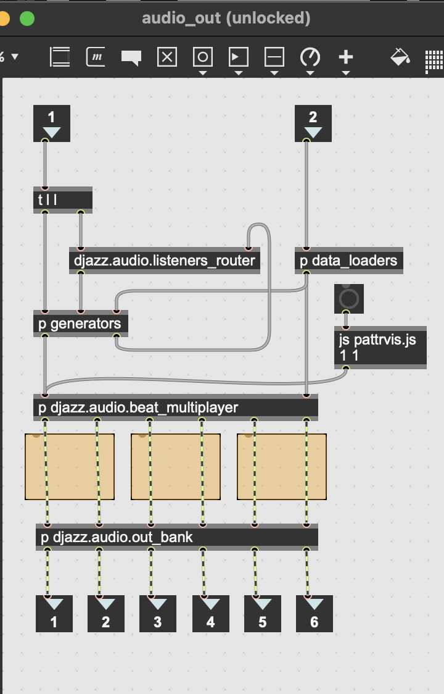

+++
title = "Audio Effects"
weight = 30
+++

Effects that modify audio output should be placed in one of two places, depending how they function.  There are two places where audio can be modified:  
1. If the object does not process audio data itself, but determines parameters to pass to the supervp player, so that it plays audio data back differently, it should be placed in the djazz.audio_beat_generator abstraction.  This is how Djazz's audio_transpose_pitch and audio_transpose_octave effects work:

2. If the object processes audio itself, it should be placed between an djazz.beat_player object and an audio.out object:

Each orange rectangle in the image above represents the placement of one audio effect, with left and right inputs and outputs for the three audio players.

